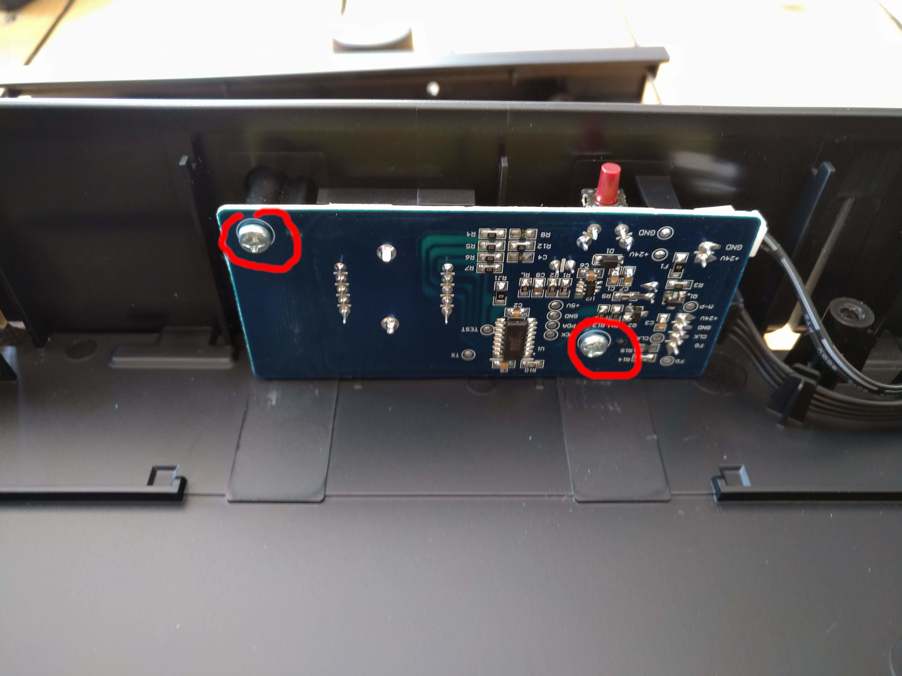
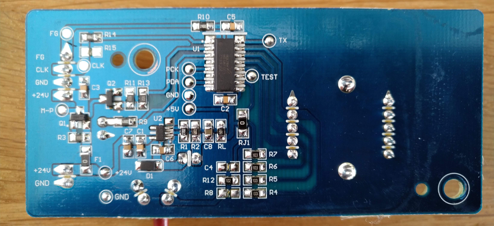

<p align="center">

&nbsp;

&nbsp;
<a href="https://www.buymeacoffee.com/sharandac" target="_blank"></a>
</p>
<hr/>

# Foernuftig

Let's make the Ikea Foernuftig air filter a little smarter. Here is the matching completely over-engineered firmware.

## prerequisite

ESP32 - Mini D1<br>
StepDown +5V converter<br>
Ikea Foernuftig<br>
and a few wires


# Install

## first step: program the esp32

Clone this repository and open it with platformIO. Remember, the SPIFF must also be flashed. On a terminal in vscode you can do it with
```bash
pio run -t uploadfs
pio run -t upload
```

After that, take a look at your monitorport ...

```text
[I][wificlient.cpp:91] wificlient_Task(): Start Wifi-Client on Core: 1
[I][wificlient.cpp:108] wificlient_Task(): WiFi connection lost, restart ... 
[I][wificlient.cpp:398] wificlient_start_softAP(): starting Wifi-AP with SSID "foernuftig_d1fd28" / "foernuftig"
[I][wificlient.cpp:399] wificlient_start_softAP(): AP IP address: 192.168.4.1
[I][ntp.cpp:65] ntp_Task(): Start NTP Task on Core: 1
[I][mqttclient.cpp:267] mqtt_client_Task(): Start MQTT-Client on Core: 1
[I][webserver.cpp:56] asyncwebserver_Task(): Start Webserver on Core: 1
[I][callback.cpp:31] callback_print():  |
[I][callback.cpp:32] callback_print():  +--'mqtt client' ( 0x3ffb961c / 1 )
[I][callback.cpp:34] callback_print():  |  +--id:'foernuftig', event mask:0003, prio: 2, active: true
[I][callback.cpp:31] callback_print():  |
[I][callback.cpp:32] callback_print():  +--'webserver' ( 0x3ffb9670 / 8 )
[I][callback.cpp:34] callback_print():  |  +--id:'/foernuftig.htm', event mask:001f, prio: 2, active: true
[I][callback.cpp:34] callback_print():  |  +--id:'/button.htm', event mask:001f, prio: 2, active: true
[I][callback.cpp:34] callback_print():  |  +--id:'/index.htm', event mask:0007, prio: 1, active: true
[I][callback.cpp:34] callback_print():  |  +--id:'/wlan.htm', event mask:001f, prio: 3, active: true
[I][callback.cpp:34] callback_print():  |  +--id:'/update.htm', event mask:0007, prio: 3, active: true
[I][callback.cpp:34] callback_print():  |  +--id:'/info.htm', event mask:0007, prio: 3, active: true
[I][callback.cpp:34] callback_print():  |  +--id:'/ntp.htm', event mask:001f, prio: 2, active: true
[I][callback.cpp:34] callback_print():  |  +--id:'/mqttclient.htm', event mask:001f, prio: 2, active: true
```
When the output look like this, congratulation!

After the first start an access point will be opened with an unique name like
```bash
foernuftig_XXXXX
```
and an not so unique password
```bash
foernuftig
```
After that you can configure the foernuftig under the following IP-address with your favorite webbrowser
```bash
http://192.168.4.1
```

## second step: pickup the pcb and wire up the StepDown converter and adjust them to +5V

step 1:remove the two cover screws<br>

step 2:remove the cover plate<br>

step 3:remove the nut<br>

step 4:remove the two pcb screws<br>

step 5:remove the two connectirs<br>

step 6:remove the controller IC<br>

<br>


step 8: connect the StepDown +5V converter to 24V and GND and adjust them to +5V<br>

## third step: wire up all the rest

### +5V power supply
+5V (StepDown converter) -> VCC ( ESP32 )<br>
GND (StepDown converter) -> GND ( ESP32 )<br>
### fan control
GPIO19 -> +24V (fan connector)<br>
GPIO18 -> CLK ( IC U1 )<br>
GPIO33 -> FG ( IC U1 )<br>
GPIO35 -> LED ( IC U1 )<br>
### 4 stage switch
GPIO21 -> R7 ( PCB )<br>
GPIO22 -> R6 ( PCB )<br>
GPIO32 -> R5 ( PCB )<br>
GPIO25 -> R4 ( PCB )<br>

### the result:

### and build in


# Contributors

Every Contribution to this repository is highly welcome! Don't fear to create pull requests which enhance or fix the project, you are going to help everybody.
<p>
If you want to donate to the author then you can buy me a coffee.
<br/><br/>
<a href="https://www.buymeacoffee.com/sharandac" target="_blank"></a>
</p>


